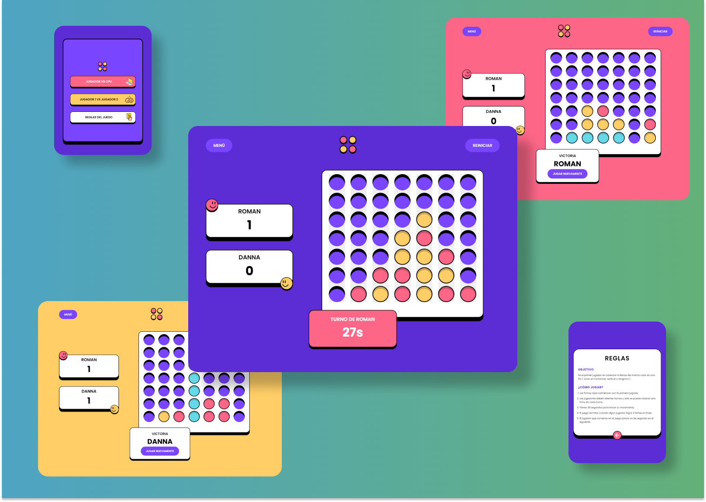

# ConnectFour &mdash; React 🔴🟢



This is a game called "Connect Four" which has as objective to make a line with four pieces of the same color, it doesn't matter if you connect 
horizontally, vertically or diagonally. 

The game has the option to play against other player or against the computer. Which has implemented an algorithm to block the player's moves.

In addition to this, there is a page where the rules of the game are explained to know how to play correctly. Before each new game, user's name is asked to have a register of the played games.

It has many animations in every page and when a winner is determined, a timer to control the turns between the players and much much more features that you can discover if you decide to play. 

If you want to play some matches with your friends, please go to: 

```
https://connectfour-srsn.netlify.app/
```

## ***Techonologies and dependencies used***

 * ReactJs
 * JavaScript
 * HTML5
 * CSS3
 * React Router DOM
 * Hooks ( useState, useEffect, useLocation, useContext, useReducer )
 * Custom Hooks ( useForm, useGoPage, useMoves, useReset, useTimer )
 * Redux
 * Netlify
 * Vite

Node was used to carry out this project, so, you must have in your system this language. Specifically version 16.16.0

Once you check this previous specification, you must install development dependencies. To do this, just execute into your terminal:

```
npm install
```

To see the changes that you apply in the code, you must run the application. Type the command:

```
npm run dev
```

## ***UI Considerations***

Colors used:

 * Primary: #7945FF
 * Secondary: #5C2DD5
 * Player 1: #FD6687
 * Player 2: #FFCE67
 * Winner: #66d9e8
 * Error: #f03e3e
 * White: #ffffff
 * Black: #000000